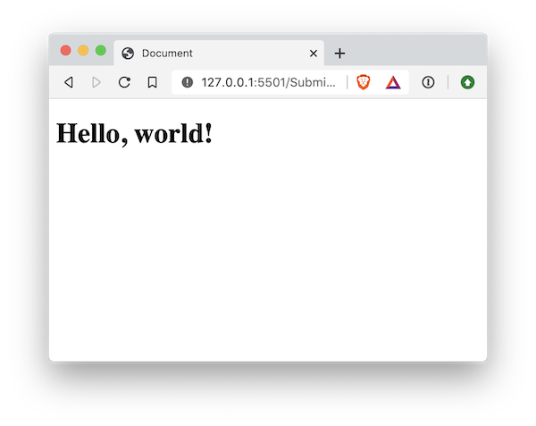
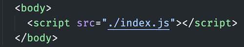

# 01 Exercise - Using JavaScript In A Webpage

Learn where to write JavaScript that loads in your web browser.

## Brief

Setup a very basic static webpage that loads and runs some Javascript in the browser. Then use the browser debugging tools to check the output of the code.



## Rationale

Understand how to link a JavaScript file to a webpage, and where to write your JavaScript.

## Getting Started

1. `clone` the exercise repository to your local computer using VS Code or the Terminal.
2. The code for this exercise should go into `/Submission`.

## Instructions Part A - Set up files and HTML

Create a standard HTML web page setup.

In the `Submission` folder:

1. Create an HTML file: `index.html`
2. Create a JS file: `index.js`
3. Open `index.html` in VS Code, and create a default HTML page. Ensure your web page has the `DOCTYPE`, `html`, `head`, and `body` elements.
4. Just before the closing `</body>` tag, add a `script` element that references the JS file.

   

## Instructions Part B - Write some JavaScript

1. Open `/Submission/index.js` in VS Code
1. Copy and paste the below JavaScript into `index.js`

   ```js
   const body = document.getElementsByTagName('body')[0];
   body.innerHTML = '<h1>Hello, world!</h1>';
   ```

   This code selects the `body` tag from the HTML and updates its HTML to be an `<h1>` element with some text

Now see if it works!

1.  Open `index.html` using Live Server
2.  You should see the text: 'Hello, world!'

    

# Submit the Exercise

- [ ] Commits are pushed to GitHub

---

<details>
  <summary>
    Git CLI Refresher
  </summary>

If you need help remembering what commands to type with `git`, use the following as a reference, or watch the [git walkthrough tutorial video](https://vimeo.com/433825571/bc1830fb90)

```shell
# when ready to commit and push
git add .

git commit -m "Added the HTML for the exercise"

git push origin master
```

</details>

# Walkthrough Solution Video

- Please attempt the exercise first prior to watching the following solution video(s)
- [Loom](https://www.loom.com/share/70ae79dfcdfe4e9d8b3f1b0fefb2e59d)

